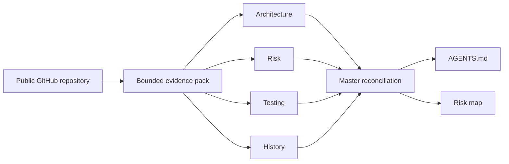

<div align="center">

<h1>RepoMind</h1>

<p><strong>Before an AI edits unfamiliar code, give it the repository's rules.</strong> RepoMind is an evidence-backed change preflight for the next ticket.</p>

<p>
  <a href="https://github.com/Kesav2k04/RepoMind/actions/workflows/ci.yml"></a>
  <a href="https://www.python.org/"></a>
  <a href="frontend/.nvmrc"></a>
  <a href="LICENSE"></a>
</p>

<p><code>Change preflight</code> &nbsp;·&nbsp; <code>Evidence-first</code> &nbsp;·&nbsp; <code>IDE-complementary</code> &nbsp;·&nbsp; <code>OpenAI Build Week</code></p>


</div>

## Judge access

| Judge artifact | Current evidence |
| --- | --- |
| Source repository | [Kesav2k04/RepoMind](https://github.com/Kesav2k04/RepoMind) |
| Verified build | [GitHub Actions CI](https://github.com/Kesav2k04/RepoMind/actions/workflows/ci.yml) |
| Public demo video (<3 minutes) | `REPLACE_WITH_YOUTUBE_URL_BEFORE_SUBMISSION` |
| No-build live demo | `REPLACE_WITH_DEPLOYMENT_URL_BEFORE_SUBMISSION` |
| Codex `/feedback` session | `REPLACE_WITH_SESSION_ID_BEFORE_SUBMISSION` |
| Devpost project | `REPLACE_WITH_DEVPOST_URL_BEFORE_SUBMISSION` |

The included screenshots are authentic **Evidence Mode · Deterministic** runs. They are not presented as proof of a hosted GPT run. Complete the marked external evidence before submission; [the handoff](docs/SUBMISSION_HANDOFF.md) records the exact fields and truthful wording.

RepoMind replaces a blind first edit with a concise repository briefing. Run it before you hand an unfamiliar codebase to a coding agent: it inventories bounded source evidence, lets four specialist lenses inspect it in parallel, reconciles their signals, and delivers two handoff artifacts:

- **`AGENTS.md`** — architecture, important files, risk areas, testing guidance, conventions, and a verification checklist.
- **Risk-annotated repository map** — an interactive view of paths that deserve attention, tied back to evidence.

## The Monday-morning job

You inherit a service and need to hand an agent a ticket such as “fix the auth race condition.” RepoMind does **not** write that fix and it does **not** replace Cursor, Codex, or a code review. It removes the orientation pass that happens before useful implementation:

1. Run a read-only preflight on the repository.
2. Download the generated `AGENTS.md`, review its evidence, and add it beside the code when it is useful.
3. Give the actual ticket to your IDE agent with shared architecture, risk boundaries, test signals, conventions, and a verification checklist already available.

The durable value is the handoff artifact, not another dashboard to revisit. Use RepoMind when a change starts in an unfamiliar, high-risk, or recently handed-off repository; do not present it as a daily codebase chat tool.

## Why developers and agents need it

| Without RepoMind | With RepoMind |
| --- | --- |
| A new contributor or agent rediscovers the repository while changing it. | The next editor starts with observed architecture, risks, test signals, and verification steps. |
| Configuration, high-churn paths, and weak test signals can be missed. | Findings carry severity, confidence, a source location when available, a reason, and a recommendation. |
| Every onboarding pass repeats the same orientation work. | A repository-specific `AGENTS.md` preserves the useful context for the next task. |

## Why this is not static analysis or codebase chat

- **Deterministic evidence handles the things software should handle.** File inventory, manifests, tests, bounded history, paths, lines, confidence, and canonical artifacts are calculated locally. RepoMind does not spend GPT tokens discovering that a repository uses React or counting files.
- **The optional GPT-5.6 step has a deliberately narrow role.** It reconciles four independent specialist views into a presentation order for existing validated findings. It cannot create findings, locations, confidence values, or artifact text. If it is unavailable, the deterministic preflight still succeeds.
- **The output leaves the dashboard.** IDE chat answers are local and ephemeral; RepoMind produces reviewable Markdown that a contributor can commit, inspect, and reuse across editors and coding agents. There is no IDE extension or local-path workflow in this MVP, so the handoff is intentionally explicit rather than implied.

## From repository to usable context




The product exposes the work rather than hiding it behind a spinner: evidence metrics, per-specialist actions and progress, reconciliation decisions, execution mode, elapsed time, and a completion summary appear in the analysis session.

## What ships

| Evidence-first specialists | Master reconciliation | Actionable handoff |
| --- | --- | --- |
| Architecture, Risk, Testing, and History workers operate on one bounded snapshot and report their own evidence-backed findings. | The Master classifies independent signals as accepted, merged, or deferred. | Read structured `AGENTS.md` sections in-app, explore the risk map, then download both Markdown artifacts. |
|  |  |  |

## Trust boundaries and execution modes

RepoMind is deliberately conservative about what it claims.

- It accepts public GitHub HTTPS repositories, shallow-clones them, and never writes back to the repository.
- The evidence inventory excludes Git metadata, dependency trees, generated output, virtual environments, and other non-source folders.
- File discovery, selected files, source excerpts, and history are bounded. If a limit is reached, the analysis is marked **partial**. An absent finding means **no signal in the retained evidence**, not “safe.”
- Canonical findings require valid paths, confidence, and evidence. Generated artifacts are mechanically checked against that evidence before display; invalid claims are withheld.

| Execution mode | Truthful meaning |
| --- | --- |
| **Evidence Mode · Deterministic** | The four local specialists and deterministic Master completed the analysis. This is the mode used by the checked-in screenshots. |
| **GPT-5.6 Native · Connected** | Available only when `OPENAI_API_KEY` is configured, the configured `OPENAI_MODEL` completes within the application deadline, and its response validates against known finding IDs. Hosted reconciliation prioritizes existing evidence; it cannot introduce findings, paths, lines, or artifacts. |

The optional hosted request is bounded by `REPOMIND_GPT_TIMEOUT_SECONDS` (45 seconds by default). Missing credentials, provider errors, invalid provider output, and timeouts all transition visibly to Evidence Mode instead of leaving a job stalled.

## Quick start

### Prerequisites

- Python 3.11+
- Node.js 20.19+ or 22.12+ (the project version is recorded in [`frontend/.nvmrc`](frontend/.nvmrc))
- Git

### 1. Start the API

```powershell
$env:PIP_CACHE_DIR = 'D:/dev-cache/pip-cache'
python -m venv .venv
.\.venv\Scripts\Activate.ps1
pip install -r requirements.txt
Copy-Item .env.example .env
uvicorn main:app --reload --port 8000
```

Evidence Mode works with the untouched `.env`. To enable the optional hosted reconciliation, set `OPENAI_API_KEY` and choose the provider-supported model through `OPENAI_MODEL`; never commit credentials.

### 2. Start the dashboard

```powershell
$env:NPM_CONFIG_CACHE = 'D:/dev-cache/npm-cache'
Set-Location frontend
$env:VITE_API_BASE_URL = 'http://localhost:8000'
npm ci
npm run dev
```

Open the local Vite address, submit a public GitHub HTTPS URL, and watch the complete pipeline.

### Canonical sample repository

Use [`https://github.com/pallets/flask`](https://github.com/pallets/flask) for the checked-in screenshot/demo target. It exercises manifests, tests, bounded Git history, risk-map output, and the generated `AGENTS.md` flow. It is public and may change over time, so run it once before recording a demo.

The latest checked-in deterministic run completed on 2026-07-18 with 236 analyzed files, 12 published findings, two artifacts, and partial-analysis disclosure. Inspect its authentic outputs directly: [sample `AGENTS.md`](docs/examples/flask/AGENTS.md) and [sample repository map](docs/examples/flask/repository-map.md).

### Supported developer environments

| Environment | Status |
| --- | --- |
| Windows 10/11 + PowerShell | Primary local workflow; commands above are written for it. |
| Linux/macOS + Bash | Supported with equivalent virtual-environment and environment-variable syntax; use a writable native cache path such as `/tmp/repomind/repos`. |
| GitHub Actions Ubuntu | The CI workflow targets Python 3.11 and the Node version in `.nvmrc`. |

Set `REPOMIND_CACHE_DIR` to any writable location when the default does not fit the host. For a separately deployed frontend, set `VITE_API_BASE_URL` at build time and allow its exact origin through `REPOMIND_CORS_ORIGINS`.

## Architecture

```text
React + TypeScript dashboard
  └─ REST API + WebSocket event stream
       └─ FastAPI analysis job
            ├─ bounded clone and repository evidence snapshot
            ├─ four concurrent deterministic specialists
            ├─ deterministic reconciliation and validated artifacts
            └─ optional, time-bounded hosted reconciliation
```

The Build Week MVP deliberately keeps jobs and artifacts in one API process and uses ephemeral clones. It is designed for a short, single-instance demo session—not durable history, accounts, private-repository OAuth, or multi-replica job recovery.

## Deployment readiness

The checked-in [Dockerfile](Dockerfile) builds the dashboard and serves it with FastAPI on one origin, avoiding a separate frontend CORS dependency. Before hosting, ensure the runtime has outbound GitHub access, `git`, a writable `REPOMIND_CACHE_DIR`, and one persistent process for the judge session. Follow [the deployment guide](docs/DEPLOYMENT.md) for the exact environment variables and preflight checks; it deliberately does not claim a deployed URL.

## Verify locally

```powershell
$env:PYTHONDONTWRITEBYTECODE = '1'
$env:TEMP = 'D:/dev-cache/pytest-tmp'
$env:TMP = 'D:/dev-cache/pytest-tmp'
New-Item -ItemType Directory -Force $env:TEMP | Out-Null
python -m pytest -q

Set-Location frontend
npm run lint
npm run build
```

For a meaningful manual check, run one public-repository analysis in Evidence Mode, open a finding to verify its evidence, inspect the partial-analysis notice when present, and download both artifacts. A hosted run is an additional opt-in check only when valid OpenAI credentials and a supported model are available.

## Codex and GPT-5.6 boundaries

### How Codex accelerated delivery

Codex was used as a development collaborator for repository review, implementation iterations, test validation, UI QA, and release-document preparation. It is not a hidden runtime dependency of a RepoMind analysis.

### Key technical decisions

- Deterministic, bounded repository evidence is authoritative for canonical findings and generated artifacts.
- `OPENAI_MODEL` is configuration, never a hardcoded runtime claim.
- The optional hosted GPT-5.6 call can only prioritize existing, validated finding IDs for presentation. It cannot create findings, paths, line numbers, confidence values, or artifact content.
- The UI shows those model-ranked priorities only when native mode succeeds. Timeouts, provider failures, and invalid output visibly fall back to deterministic Evidence Mode.
- Every canonical source claim requires repository evidence; partial analysis is disclosed rather than treated as complete coverage.

## Submission evidence

The repository is ready for the final human-supplied evidence, but it does not fabricate it. Before Devpost submission, add the public video, deployment URL, Codex session ID, Devpost URL, and a native-mode record only after a successful visible GPT-5.6 run. Use [the handoff](docs/SUBMISSION_HANDOFF.md), [judge path](docs/JUDGE_PATH.md), and [demo proof checklist](docs/DEMO_PROOF_CHECKLIST.md) to complete those fields consistently.

## License

RepoMind is available under the [MIT License](LICENSE).
