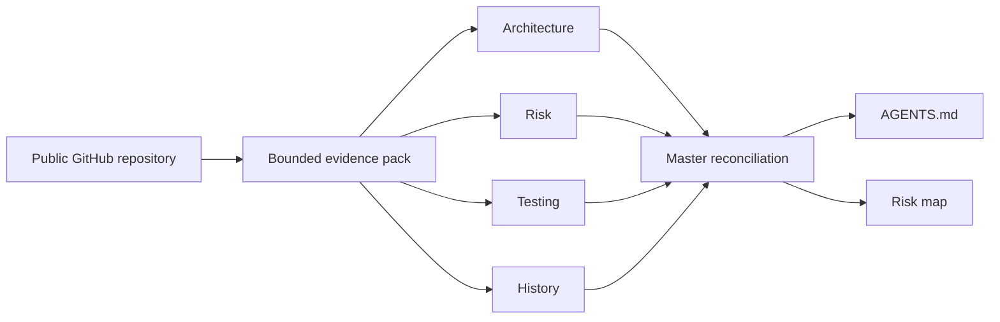

# RepoMind

> **Context before code.** RepoMind turns a public GitHub repository into evidence-backed operating context for the next developer or coding agent.

[](https://github.com/Kesav2k04/RepoMind/actions/workflows/ci.yml)
[](https://www.python.org/)
[](frontend/.nvmrc)
[](LICENSE)

`Developer tools` · `Evidence-first` · `Agent-ready context` · `OpenAI Build Week`


RepoMind replaces a blind first edit with a concise repository briefing. It inventories bounded source evidence, lets four specialist lenses inspect it in parallel, reconciles their signals, and delivers two handoff artifacts:

- **`AGENTS.md`** — architecture, important files, risk areas, testing guidance, conventions, and a verification checklist.
- **Risk-annotated repository map** — an interactive view of paths that deserve attention, tied back to evidence.

## Why developers and agents need it

| Without RepoMind | With RepoMind |
| --- | --- |
| A new contributor or agent rediscovers the repository while changing it. | The next editor starts with observed architecture, risks, test signals, and verification steps. |
| Configuration, high-churn paths, and weak test signals can be missed. | Findings carry severity, confidence, a source location when available, a reason, and a recommendation. |
| Every onboarding pass repeats the same orientation work. | A repository-specific `AGENTS.md` preserves the useful context for the next task. |

## From repository to usable context




The product exposes the work rather than hiding it behind a spinner: evidence metrics, per-specialist actions and progress, reconciliation decisions, execution mode, elapsed time, and a completion summary appear in the analysis session.

## What ships

| Evidence-first specialists | Master reconciliation | Actionable handoff |
| --- | --- | --- |
| Architecture, Risk, Testing, and History workers operate on one bounded snapshot and report their own evidence-backed findings. | The Master classifies independent signals as accepted, merged, or deferred. | Read structured `AGENTS.md` sections in-app, explore the risk map, then download both Markdown artifacts. |
|  |  |  |

## Trust boundaries and execution modes

RepoMind is deliberately conservative about what it claims.

- It accepts public GitHub HTTPS repositories, shallow-clones them, and never writes back to the repository.
- The evidence inventory excludes Git metadata, dependency trees, generated output, virtual environments, and other non-source folders.
- File discovery, selected files, source excerpts, and history are bounded. If a limit is reached, the analysis is marked **partial**. An absent finding means **no signal in the retained evidence**, not “safe.”
- Canonical findings require valid paths, confidence, and evidence. Generated artifacts are mechanically checked against that evidence before display; invalid claims are withheld.

| Execution mode | Truthful meaning |
| --- | --- |
| **Evidence Mode · Deterministic** | The four local specialists and deterministic Master completed the analysis. This is the mode used by the checked-in screenshots. |
| **GPT-5.6 Native · Connected** | Available only when `OPENAI_API_KEY` is configured, the configured `OPENAI_MODEL` completes within the application deadline, and its response validates against known finding IDs. Hosted reconciliation prioritizes existing evidence; it cannot introduce findings, paths, lines, or artifacts. |

The optional hosted request is bounded by `REPOMIND_GPT_TIMEOUT_SECONDS` (45 seconds by default). Missing credentials, provider errors, invalid provider output, and timeouts all transition visibly to Evidence Mode instead of leaving a job stalled.

## Quick start

### Prerequisites

- Python 3.11+
- Node.js 20.19+ or 22.12+ (the project version is recorded in [`frontend/.nvmrc`](frontend/.nvmrc))
- Git

### 1. Start the API

```powershell
$env:PIP_CACHE_DIR = 'D:/dev-cache/pip-cache'
python -m venv .venv
.\.venv\Scripts\Activate.ps1
pip install -r requirements.txt
Copy-Item .env.example .env
uvicorn main:app --reload --port 8000
```

Evidence Mode works with the untouched `.env`. To enable the optional hosted reconciliation, set `OPENAI_API_KEY` and choose the provider-supported model through `OPENAI_MODEL`; never commit credentials.

### 2. Start the dashboard

```powershell
$env:NPM_CONFIG_CACHE = 'D:/dev-cache/npm-cache'
Set-Location frontend
$env:VITE_API_BASE_URL = 'http://localhost:8000'
npm ci
npm run dev
```

Open the local Vite address, submit a public GitHub HTTPS URL, and watch the complete pipeline. [FastAPI](https://github.com/fastapi/fastapi) is a useful demo target because it has a recognisable structure, tests, manifests, and active history.

### Supported developer environments

| Environment | Status |
| --- | --- |
| Windows 10/11 + PowerShell | Primary local workflow; commands above are written for it. |
| Linux/macOS + Bash | Supported with equivalent virtual-environment and environment-variable syntax; use a writable native cache path such as `/tmp/repomind/repos`. |
| GitHub Actions Ubuntu | The CI workflow targets Python 3.11 and the Node version in `.nvmrc`. |

Set `REPOMIND_CACHE_DIR` to any writable location when the default does not fit the host. For a separately deployed frontend, set `VITE_API_BASE_URL` at build time and allow its exact origin through `REPOMIND_CORS_ORIGINS`.

## Architecture

```text
React + TypeScript dashboard
  └─ REST API + WebSocket event stream
       └─ FastAPI analysis job
            ├─ bounded clone and repository evidence snapshot
            ├─ four concurrent deterministic specialists
            ├─ deterministic reconciliation and validated artifacts
            └─ optional, time-bounded hosted reconciliation
```

The Build Week MVP deliberately keeps jobs and artifacts in one API process and uses ephemeral clones. It is designed for a short, single-instance demo session—not durable history, accounts, private-repository OAuth, or multi-replica job recovery.

## Verify locally

```powershell
$env:PYTHONDONTWRITEBYTECODE = '1'
$env:TEMP = 'D:/dev-cache/pytest-tmp'
$env:TMP = 'D:/dev-cache/pytest-tmp'
New-Item -ItemType Directory -Force $env:TEMP | Out-Null
python -m pytest -q

Set-Location frontend
npm run lint
npm run build
```

For a meaningful manual check, run one public-repository analysis in Evidence Mode, open a finding to verify its evidence, inspect the partial-analysis notice when present, and download both artifacts. A hosted run is an additional opt-in check only when valid OpenAI credentials and a supported model are available.

## Codex and GPT-5.6 boundaries

Codex was used as a development collaborator; it is not a hidden runtime dependency of a RepoMind analysis. RepoMind’s runtime GPT integration is optional and narrow: it uses the configured model for Master reconciliation of the bounded specialist inventory. The deterministic evidence layer remains authoritative in either mode.

This repository intentionally does not publish a session ID, video URL, live deployment URL, or claim a successful hosted run without verifiable evidence. The included screenshots are authentic local captures of **Evidence Mode · Deterministic**.

## License

RepoMind is available under the [MIT License](LICENSE).
