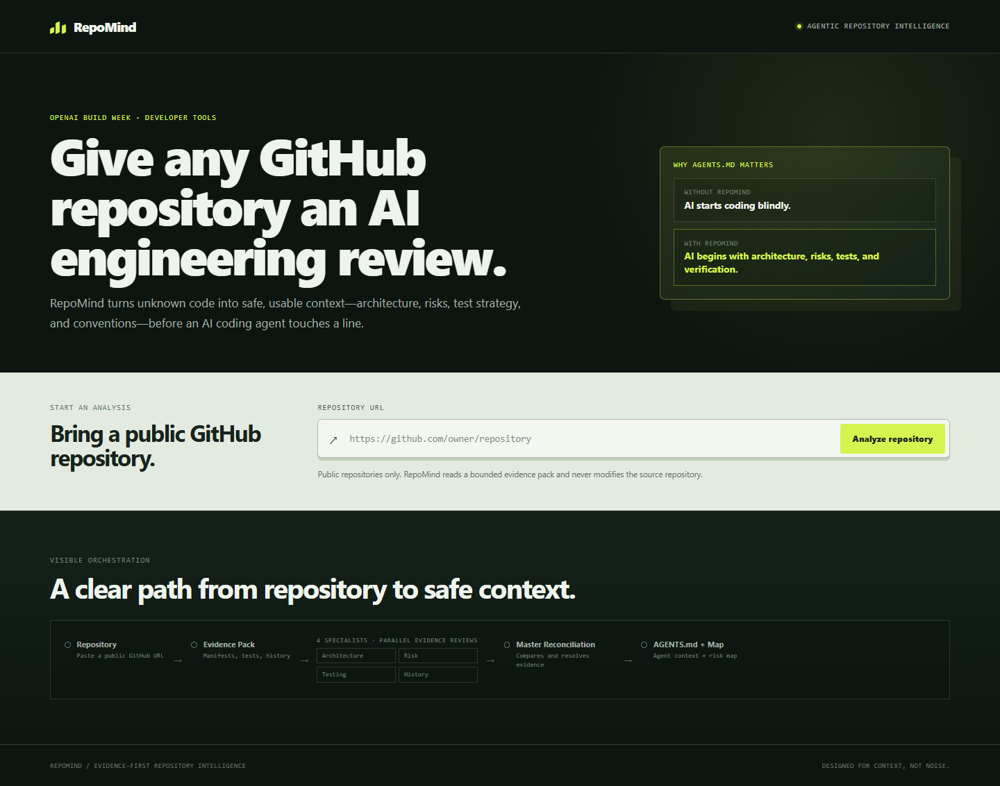
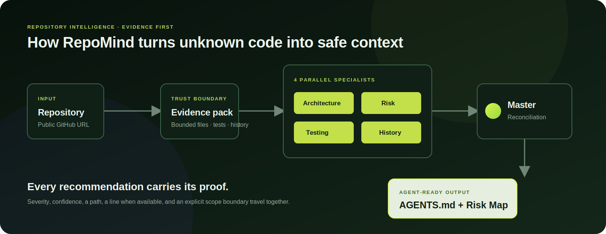
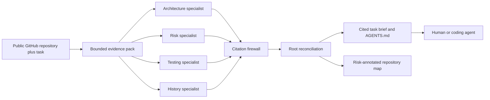
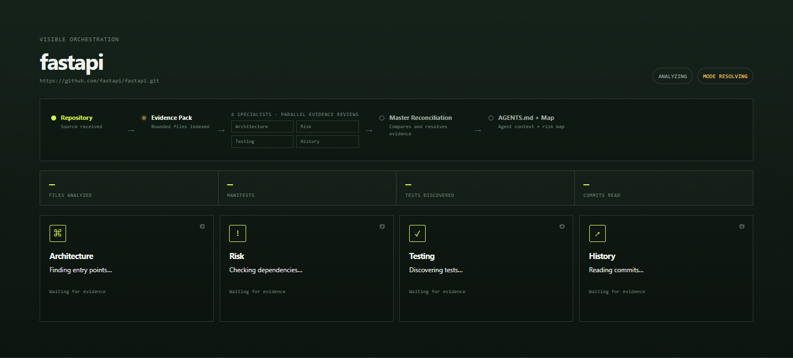
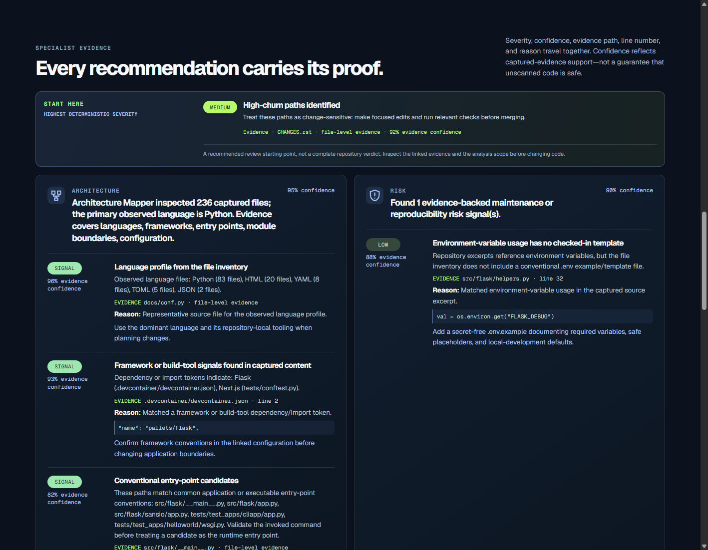
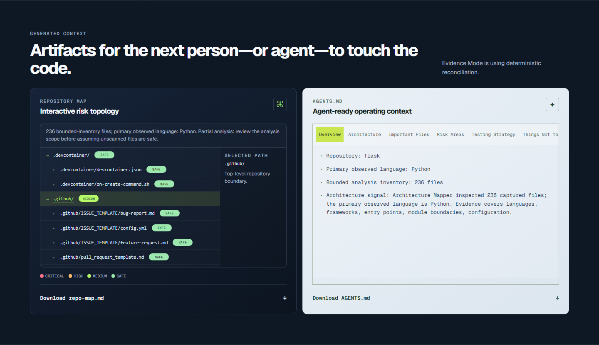
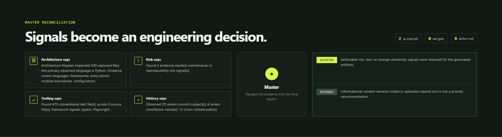

<div align="center">

# RepoMind

**Context before code. Give the next coding agent a cited change brief before its first edit.**

RepoMind prepares a public GitHub repository for one concrete change. It returns the files to inspect, risk boundaries to respect, and observed checks to run, with source evidence that a human or coding agent can verify.

[](https://github.com/Kesav2k04/RepoMind/actions/workflows/ci.yml)
[](https://www.python.org/)
[](frontend/.nvmrc)
[](LICENSE)
[](https://repomind-r9zo.onrender.com/)
[](https://www.youtube.com/watch?v=Ht1RKE4rIYo)

`GPT-5.6 source specialists` &middot; `citation firewall` &middot; `task-scoped preflight` &middot; `MCP + CLI`

</div>

> **The Monday-morning job:** You have a ticket to fix an auth race, add a webhook, or change a fragile workflow. Your coding agent begins by listing directories, opening unrelated files, guessing where tests live, and spending context on orientation. RepoMind compresses that first pass into a cited handoff so the next editor can start with the right evidence.

<p align="center">
  
</p>

## Why RepoMind exists

Coding agents are fast at implementation once they understand a repository. The expensive part is the orientation tax: locating the real entry point, learning local conventions, discovering the verification command, and noticing a fragile boundary before the patch touches it.

RepoMind does not compete with an IDE assistant or write the patch. It sits before the coding loop as an independent evidence preflight. Cursor, Copilot, Codex, Claude Code, and human contributors can use the generated handoff to make a better first plan.

| For one requested change | RepoMind returns |
| --- | --- |
| **Where should I start?** | A task brief with cited files to inspect first. |
| **What could break?** | Risk findings and an evidence-aware repository map. |
| **How should I verify it?** | Observed test locations and repository commands, never invented commands. |
| **What should my agent know next time?** | A structured `AGENTS.md` that can live beside the repository. |

### When to use it

Use RepoMind before unfamiliar, cross-cutting, high-risk, or agent-assisted work. It is especially useful when a task crosses authentication, data boundaries, test suites, or recently changing files. Skip it for a tiny repository that you can read in one pass.

## What you can verify in three minutes

| In under three minutes | Evidence |
| --- | --- |
| Understand the value | Read [Why RepoMind exists](#why-repomind-exists), then view [the architecture](#architecture-one-trusted-path). |
| Verify it builds | [GitHub Actions CI](https://github.com/Kesav2k04/RepoMind/actions/workflows/ci.yml) runs backend tests plus frontend lint, tests, and production build. |
| Try the live product | Open the [public Render deployment](https://repomind-r9zo.onrender.com/). It is a single-origin FastAPI service; pre-warm it before a live walkthrough because free hosting can sleep. |
| Inspect real output | Open the authentic [Flask Evidence Mode sample](docs/examples/flask/README.md), [AGENTS.md](docs/examples/flask/AGENTS.md), and [repository map](docs/examples/flask/repository-map.md). |
| Check the AI boundary | Read [Execution modes](#execution-modes) and the [citation firewall](#the-citation-firewall). |
| Try the handoff | Run the [CLI](#cli) or connect the [stdio MCP server](#mcp). Both use the same preflight path as the dashboard. |

RepoMind never fabricates a source citation, model mode, line number, confidence score, or completion state.

## Architecture: one trusted path

<p align="center">
  
</p>



Every interface reaches the same trusted preflight path. The dashboard exposes recorded progress while the CLI and MCP server deliver the same reviewed handoff directly to a coding workflow.

| Layer | Responsibility | Trust boundary |
| --- | --- | --- |
| **Dashboard** | React and TypeScript input, progress, evidence, and artifact views. | Displays recorded events only. |
| **Preflight API** | FastAPI request lifecycle, WebSocket stream, bounded job admission, and same-origin static serving. | Never writes to the analyzed repository. |
| **Evidence pack** | GitHub URL validation, shallow clone, bounded file inventory, excerpts, and Git history. | Public HTTPS repositories only; scope limits are disclosed. |
| **Specialists** | Architecture, Risk, Testing, and History reviews. | Native specialists receive read-only bounded tools; Evidence Mode remains deterministic. |
| **Citation firewall** | Verifies path, line range, quoted source, and same-worker provenance. | Unsupported claims are withheld. |
| **Handoff** | Task brief, `AGENTS.md`, and interactive repository map. | Artifacts are validated again before download. |

<table>
  <tr>
    <td width="33%"><br /><strong>Watch the work</strong><br />Each specialist shows a real action, progress, and completion state.</td>
    <td width="33%"><br /><strong>Inspect the claim</strong><br />Findings expose severity, confidence, source location, reason, and recommendation.</td>
    <td width="33%"><br /><strong>Use the handoff</strong><br />Review the structured AGENTS.md and repository map before editing.</td>
  </tr>
</table>

## Execution modes

RepoMind is explicit about where deterministic repository handling ends and GPT-5.6 begins.

### GPT-5.6 Native mode

When `OPENAI_API_KEY` and a provider-supported `OPENAI_MODEL` are configured, the application launches four independent GPT-5.6 specialists in parallel:

- **Architecture** identifies entry points, module boundaries, dependencies, and a likely home for the requested change.
- **Risk** evaluates authentication, IO, secrets, dynamic execution, and task blast radius in context.
- **Testing** compares the requested behavior with observed tests and reports only observed verification commands.
- **History** reads bounded Git history for churn, fix chains, and fragile paths.

Each specialist works through a bounded, read-only toolbelt: `list_files`, `read_file`, `grep`, `git_log`, and `git_blame`. It must read source before returning a structured claim. A separate GPT-5.6 root may only prioritize, merge, or defer finding IDs that survived the citation firewall. It cannot add a factual claim, path, line number, confidence value, or artifact text.

### Evidence Mode

When credentials are absent, the provider fails, output is invalid, or the application deadline is reached, RepoMind completes quickly in deterministic Evidence Mode. Its four deterministic specialists use transparent lexical task matching over retained source and verified finding paths. Evidence Mode is useful, but it does not claim model-level task understanding or prove that a Native run occurred.

| Mode | What the user can truthfully infer |
| --- | --- |
| **GPT-5.6 Native** | Four GPT-5.6 source specialists used bounded read-only tools, their retained claims passed the firewall, and a separate root reconciled verified finding IDs. |
| **Evidence Mode** | Deterministic specialists analyzed the bounded snapshot. No model source claim is implied. |

The checked-in Flask sample and product screenshots are Evidence Mode output. `OPENAI_MODEL` is configuration, not a hardcoded marketing claim.

## The citation firewall

The firewall makes the AI useful without asking the user to trust model narration. A Native claim is withheld unless RepoMind can validate all four conditions:

1. The cited path exists in the bounded checkout.
2. The cited line range is valid.
3. The quoted evidence appears in that exact source range.
4. The same specialist received that source through its own read-only tool call.

Model self-confidence is not treated as evidence. Retained Native confidence is derived from citation quality. The UI shows proposed, verified, and withheld claim totals, and only verified findings can reach generated artifacts. A final artifact validation pass checks `AGENTS.md` and the repository map against returned repository evidence again.

<p align="center">
  
</p>

## Use RepoMind in the coding loop

### CLI

The CLI is the fastest route from a ticket to a local handoff. It runs the same bounded pipeline as the dashboard and writes reviewable Markdown.

```powershell
python -m venv .venv
.\.venv\Scripts\Activate.ps1
python -m pip install -r requirements.txt
python -m pip install -e .

repomind preflight https://github.com/pallets/flask `
  --task "Add a focused test around an error-handling change." `
  -o .\AGENTS.md
```

The command also writes `repo-map.md` beside `AGENTS.md`. Existing output requires `--force`, so a preflight cannot silently overwrite a prior handoff.

RepoMind dogfoods this workflow: this repository's [root `AGENTS.md`](AGENTS.md) was seeded from a local Evidence Mode preflight and then reviewed to remove temporary task context.

### MCP

RepoMind exposes a local stdio MCP server so a coding agent can request the same preflight before changing code. After the editable install above, add this generic entry to your MCP client configuration:

```json
{
  "mcpServers": {
    "repomind": {
      "command": "repomind-mcp"
    }
  }
}
```

The server provides two tools:

- `repomind_preflight(repo_url, task_description)` returns the task brief, verified findings, `AGENTS.md`, and repository map.
- `repomind_get_artifact(job_id, name)` returns `AGENTS.md` or `repo-map.md` from the current local MCP session.

For Windows clients that do not inherit the virtual environment, point `command` to the absolute `repomind-mcp.exe` path inside `.venv\Scripts`. MCP artifacts are session-local. Run a new preflight if the server restarts.

### Dashboard

```powershell
# Terminal 1
uvicorn main:app --reload --port 8000

# Terminal 2
Set-Location frontend
$env:VITE_API_BASE_URL = 'http://localhost:8000'
npm ci
npm run dev
```

Paste a public GitHub HTTPS URL and describe the desired change. A useful task includes behavior, a constraint, and a boundary. For example: `Add a focused test around an error-handling change without changing the public API.`

## Project structure

```text
RepoMind/
├── main.py                 # FastAPI API, WebSocket events, and dashboard serving
├── preflight.py            # One shared API, CLI, and MCP execution path
├── repository.py           # GitHub validation, bounded clone, and evidence snapshot
├── native_agents.py        # GPT-5.6 source specialists and citation firewall
├── master.py               # Native or deterministic reconciliation and fallbacks
├── workers/                # Deterministic Architecture, Risk, Testing, History workers
├── artifacts.py            # Task brief, AGENTS.md, map generation, validation
├── repomind_cli.py         # Terminal handoff
├── repomind_mcp.py         # stdio MCP handoff
├── frontend/
│   ├── src/                # React UI, event timeline, API normalization
│   └── public/             # Social preview asset
├── tests/                  # Backend contract, reliability, and trust-boundary tests
├── docs/
│   ├── examples/flask/     # Authentic Evidence Mode output
│   ├── images/             # Product screenshots
│   └── assets/             # Architecture graphic
├── Dockerfile              # Remote single-service deployment image
├── .env.example            # Runtime configuration template without secrets
└── AGENTS.md               # Durable contributor and coding-agent guidance
```

The API, CLI, and MCP server share `run_preflight()`. The dashboard therefore cannot hide a different trust path from agent-native interfaces.

## Limits and honest boundaries

- Public GitHub HTTPS repositories only. RepoMind shallow-clones read-only and never writes back.
- Repository traversal, file size, total content, tool reads, tool results, history, and output are bounded. A truncated run is marked **partial**. No finding does not mean safe.
- Native provider work has an application deadline through `REPOMIND_GPT_TIMEOUT_SECONDS`, 45 seconds by default. Missing credentials, timeout, provider failure, or invalid output visibly transitions to Evidence Mode.
- This Build Week MVP keeps jobs and dashboard artifacts in one process. It is designed for a bounded single-instance demo, not accounts, durable history, private-repository OAuth, or multi-replica recovery.
- RepoMind is a change-preflight and evidence tool, not a security audit or a guarantee that a proposed change is correct. Review cited source and run the reported checks.

## Local verification

```powershell
python -m pytest -q

Set-Location frontend
npm run lint
npm run test
npm run build
```

CI uses Python 3.11 and the Node version pinned in [`frontend/.nvmrc`](frontend/.nvmrc).

## How Codex and GPT-5.6 contributed

| Contribution | What RepoMind can show |
| --- | --- |
| **Codex during development** | Codex supported architecture review, repository exploration, implementation, test design, failure-mode review, UI QA, documentation, and release validation. It is not a hidden runtime dependency. |
| **GPT-5.6 at runtime** | In Native mode, four source-reading GPT-5.6 specialists use bounded function tools and a separate GPT-5.6 root reconciles only firewall-verified finding IDs. |
| **Deterministic trust controls** | Citation validation, artifact validation, bounded cloning, partial-analysis disclosure, and fallback mode are application code rather than model promises. |
| **Agent-native delivery** | The CLI, MCP server, and dashboard all call the same `run_preflight()` pipeline, so the handoff can enter a real coding workflow. |

## License

[MIT](LICENSE)
