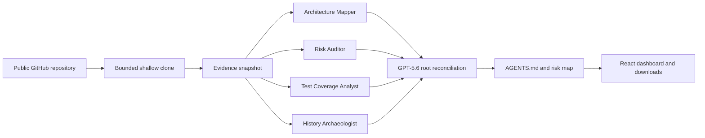

# RepoMind

RepoMind is an AI developer tool built for the OpenAI Build Week Developer Tools track. Give it a public GitHub repository and it independently inspects its architecture, code risk, test coverage, and Git history, then reconciles that evidence into two developer-facing artifacts:

- `AGENTS.md` — repository-specific guidance for future AI coding agents.
- A risk-annotated repository map — a navigable view of important paths and their evidence-backed risks.

RepoMind is deliberately evidence-first: findings link back to repository paths and the product can produce a useful deterministic result even when an OpenAI API key is unavailable.

## What the MVP does

- Accepts public GitHub HTTPS repository URLs.
- Creates a bounded, shallow local analysis snapshot; dependency folders, generated output, virtual environments, and Git metadata are excluded from evidence collection.
- Runs four specialist analyses concurrently:
  - **Architecture** — entry points, project layout, manifests, languages, and module boundaries.
  - **Risk** — code/configuration risk signals and maintenance concerns.
  - **Test coverage** — test frameworks, test inventory, and coverage gaps inferred from the repository.
  - **History** — recent commit activity, contributors, churn, and change-sensitive paths.
- Reconciles the specialist reports into an `AGENTS.md` artifact and a Markdown repository map with risk severity labels.
- Streams analysis progress to the Vite frontend so the four-agent workflow is visible during a demo.

## Architecture

```text
Public GitHub URL
       |
       v
FastAPI job API -----> bounded shallow clone on D:\\dev-cache
       |                         |
       |                         v
       |                    Evidence snapshot
       |                         |
       v                         v
WebSocket progress <--- Architecture / Risk / Testing / History workers
                                 |
                                 v
                    GPT-5.6 native Multi-agent reconciliation
                         (when API credentials are configured)
                                 |
                                 v
                   AGENTS.md + risk-annotated repository map
                                 |
                                 v
                       React/Vite preview and downloads
```

The backend owns the API contracts, evidence limits, artifact generation, and fallback path. Specialist reports share a structured finding format with a role, severity, summary, repository paths, recommendation, and confidence. The frontend consumes job status and WebSocket events, previews the generated Markdown, and provides artifact downloads.

## System diagram



For an interactive, code-derived dependency visual, open the generated [Graphify graph](file:///D:/RepoMind/graphify-out/graph.html).
## Reconciliation modes

RepoMind has two transparent output modes:

| Mode | When it is used | Behavior |
| --- | --- | --- |
| `native_multi_agent` | `OPENAI_API_KEY` is configured and the hosted run succeeds | Uses the configured GPT model to coordinate native Multi-agent reconciliation over the bounded evidence and specialist reports. |
| `evidence_fallback` | No API key is configured, the hosted run fails, or its response is invalid | Generates artifacts deterministically from validated worker findings, keeping the application demoable without external model access. |

The UI and API metadata identify which mode produced a result. The fallback is not presented as model-generated analysis.

## Technology stack

- **Backend:** Python, FastAPI, Pydantic, Git CLI, and the OpenAI Python SDK.
- **AI orchestration:** GPT-5.6 native Multi-agent, configured through environment variables rather than hardcoded model identifiers.
- **Frontend:** React, TypeScript, Vite, and a native WebSocket progress stream.
- **Runtime storage:** bounded in-memory jobs and ephemeral local repository clones; no database is required for the MVP.

## Local setup

### Prerequisites

- Python 3.11 or newer
- Node.js 20 or newer
- Git
- An OpenAI API key only if you want to exercise native GPT-5.6 Multi-agent reconciliation

### Configure the backend

From the project root, create and activate a virtual environment on `D:`. Keep dependency caches off `C:` in this workspace.

```powershell
$env:PIP_CACHE_DIR = 'D:/dev-cache/pip-cache'
python -m venv .venv
.\.venv\Scripts\Activate.ps1
pip install -r requirements.txt
```

Configure environment variables using your local environment file or shell:

```env
# Optional: without a key RepoMind uses evidence_fallback.
OPENAI_API_KEY=

# Model selection is configuration, not source code.
OPENAI_MODEL=gpt-5.6-sol

# Keep cloned repositories and analysis cache on D:.
REPOMIND_CACHE_DIR=D:/dev-cache/repomind/repos
```

`OPENAI_MODEL` currently defaults to `gpt-5.6-sol` when it is unset. Do not commit credentials or an `.env` containing a real key.

Start the API from the project root:

```powershell
uvicorn main:app --reload --port 8000
```

The backend exposes a health endpoint at `/health`, analysis endpoints under `/api/analyze`, and a job event WebSocket at `/api/analyze/{job_id}/events`.

### Configure the frontend

In a second terminal:

```powershell
$env:NPM_CONFIG_CACHE = 'D:/dev-cache/npm-cache'
Set-Location frontend
npm install
npm run dev
```

Use the Vite development URL printed by the command. Submit a small public GitHub HTTPS repository first; it makes the specialist timeline and generated artifact previews easy to inspect.

## API overview

### Start an analysis

```http
POST /api/analyze
Content-Type: application/json

{
  "repo_url": "https://github.com/owner/repository"
}
```

The request returns `202 Accepted` with a `job_id`. Only public GitHub HTTPS URLs are in scope for the MVP.

### Monitor and download

- `GET /api/analyze/{job_id}` — analysis state, specialist reports, and result metadata.
- `WS /api/analyze/{job_id}/events` — lifecycle and specialist progress events.
- `GET /api/analyze/{job_id}/artifacts/AGENTS.md` — generated agent instructions.
- `GET /api/analyze/{job_id}/artifacts/repo-map.md` — generated risk-annotated map.
- `GET /health` — service health check.

High- and critical-severity findings should always point to one or more relevant repository paths. Output is bounded by clone, file-count, file-size, history-depth, and evidence-size limits so large repositories may receive a partial-analysis notice instead of an unbounded scan.

## Verification

Run backend tests from the project root and frontend checks from `frontend/`:

```powershell
$env:PYTHONDONTWRITEBYTECODE = '1'
pytest

Set-Location frontend
npm run lint
npm run build
```

The OpenAI path is tested with mocked responses; a live analysis is an opt-in smoke test and requires `OPENAI_API_KEY`. The normal local verification path must succeed without a network call to OpenAI.

After code changes in this workspace, rebuild the Graphify code graph from the repository root:

```powershell
python -c "from graphify.watch import _rebuild_code; from pathlib import Path; _rebuild_code(Path('.'))"
```

## Build Week demo flow

1. Open RepoMind and enter a small public GitHub repository URL.
2. Show the four role-specific agents moving through architecture, risk, testing, and history analysis.
3. Open the completed findings and point out the repository-path evidence behind a high-value risk or change-sensitive file.
4. Show the reconciliation mode: native GPT-5.6 Multi-agent when configured, or the clearly labeled evidence fallback otherwise.
5. Preview and download the generated `AGENTS.md` and risk-annotated repository map.
6. Explain the core value: AI coding agents get repository-specific instructions and risk context before they begin changing code.

## Deployment and submission checklist

Deployment is not included in this repository yet. Before submission, complete and verify the following:

- [ ] Deploy the FastAPI service and static Vite frontend with a public, judge-accessible URL.
- [ ] Configure `OPENAI_API_KEY`, `OPENAI_MODEL`, and a writable non-`C:` clone/cache location in the deployment environment.
- [ ] Test the deployed app against a small public repository and confirm both artifacts download.
- [ ] Record a short demo showing concurrent specialist agents and the final artifact workflow.
- [ ] State exactly how Codex implementation work and GPT-5.6 native Multi-agent reconciliation are used.
- [ ] Provide any Build Week-required feedback/session evidence and submission links.

## Current scope and boundaries

RepoMind currently targets public GitHub repositories. Private-repository OAuth, persistent user accounts, saved analysis history, automatic pull requests, billing, and full semantic code-graph analysis are intentionally outside the MVP. The tool does not write artifacts back to the source repository.

## License

License selection is pending.
