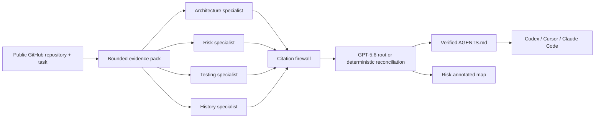

<div align="center">


# RepoMind

**Give the next coding agent a cited change preflight, not a blind first edit.**

RepoMind reads a public GitHub repository through bounded, read-only tools, focuses on the change you are about to make, and produces a verified `AGENTS.md`, risk map, and task brief for Codex, Cursor, Claude Code, or a human contributor.

[](https://github.com/Kesav2k04/RepoMind/actions/workflows/ci.yml)
[](https://www.python.org/)
[](frontend/.nvmrc)
[](LICENSE)

`GPT-5.6 source specialists` &middot; `citation firewall` &middot; `task-scoped preflight` &middot; `MCP + CLI`

</div>

> **The Monday-morning job:** before asking a coding agent to fix an auth race, add a webhook, or change a fragile workflow, run one preflight. It tells the next editor which files to read, what not to disturb, which tests matter, and which claims have real source support. RepoMind does not replace the IDE or write the patch; it removes the costly orientation loop before the patch.

<p align="center">
  
</p>

## Judge quick path

| In under three minutes | Evidence |
| --- | --- |
| Understand the product | Read the Monday-morning job above, then the [actual runtime flow](#what-actually-runs). |
| Verify it builds | [GitHub Actions CI](https://github.com/Kesav2k04/RepoMind/actions/workflows/ci.yml) runs backend tests plus frontend lint, tests, and production build. |
| See real output | Open the authentic [Flask Evidence Mode sample](docs/examples/flask/README.md), [AGENTS.md](docs/examples/flask/AGENTS.md), and [risk map](docs/examples/flask/repository-map.md). |
| Try it as an agent tool | Run the [CLI](#cli) or add the [stdio MCP server](#mcp) in a local agent configuration. |
| Inspect the trust boundary | Read [citation firewall](#citation-firewall) and [limits](#limits-and-honest-boundaries). |

Submission-only public artifacts are deliberately not fabricated in this repository. Insert the public video, live URL, Devpost link, and Codex `/feedback` session in [the submission handoff](docs/SUBMISSION_HANDOFF.md) after they exist.

## The product loop



The dashboard makes the sequence inspectable: evidence metrics, actual source-tool events, specialist progress, firewall decisions, reconciliation, execution mode, elapsed time, and downloadable artifacts. It does not animate invented agent activity.

<table>
  <tr>
    <td width="33%"><br /><strong>Watch the work</strong><br />Each specialist has a real action and completion state.</td>
    <td width="33%"><br /><strong>Inspect the claim</strong><br />Findings expose severity, confidence, source location, reason, and recommendation.</td>
    <td width="33%"><br /><strong>Use the handoff</strong><br />Review the structured AGENTS.md and explore the risk map before editing.</td>
  </tr>
</table>

## What actually runs

RepoMind is intentionally explicit about where traditional software ends and GPT-5.6 begins.

### GPT-5.6 Native mode

When `OPENAI_API_KEY` is configured, RepoMind's application-level master/worker flow launches **four independent GPT-5.6 specialist calls in parallel**. Each is given a distinct job and a bounded, read-only toolbelt:

- **Architecture** maps entry points, boundaries, dependencies, and the likely home for the requested change.
- **Risk** examines auth, IO, secrets, dynamic execution, and the task's blast radius in context.
- **Testing** compares target behavior with observed tests and returns only observed verification commands.
- **History** reads bounded Git history for churn, fix chains, and fragile paths.

The tools are `list_files`, `read_file`, `grep`, `git_log`, and `git_blame`. They are bounded by the same source, line, result, and history limits used everywhere else; no specialist can execute arbitrary shell commands or write to the analyzed repository. Each specialist must source-read before it may return structured findings. A separate GPT-5.6 root receives only firewall-verified finding IDs and can prioritize, merge, or defer them. It cannot invent a claim, path, line number, confidence value, or artifact text.

### Evidence Mode

Without an API key, after a provider error, or after the application deadline, RepoMind completes with its four deterministic evidence specialists. This is a useful, visibly labelled fallback - not proof that a native run occurred. The checked-in screenshots and Flask sample are **Evidence Mode** output.

| Mode | What the user can truthfully infer |
| --- | --- |
| **GPT-5.6 Native** | Four GPT-5.6 source specialists used read-only tools; their retained claims passed the firewall; a separate root reconciled verified IDs. |
| **Evidence Mode** | Deterministic specialists analyzed the bounded snapshot; no model source claim is implied. |

`OPENAI_MODEL` is configuration, not a hardcoded claim. The default is `gpt-5.6-sol`; use a provider-supported model in your environment.

## Citation firewall

This is the product's differentiator, not a decorative safety label. A native model claim is withheld unless RepoMind can prove all of the following:

1. The cited path exists in the bounded checkout.
2. The cited line range is valid.
3. The quoted evidence appears in that exact source range.
4. The same specialist received that source through its own read-only tool call.

Model self-reported confidence is not authoritative. Native confidence is derived from citation quality. The UI shows proposed, verified, and withheld claim counts, and only verified findings can reach the generated artifacts. Artifact validation then checks the final `AGENTS.md` and map against the returned repository evidence again.

<p align="center">
  
</p>

## Use RepoMind

### CLI

The CLI is the fastest handoff for a real task. It runs the same bounded pipeline as the dashboard and writes reviewable Markdown locally.

```powershell
$env:PIP_CACHE_DIR = 'D:/dev-cache/pip-cache'
python -m venv .venv
.\.venv\Scripts\Activate.ps1
python -m pip install -r requirements.txt
python -m pip install -e .

repomind preflight https://github.com/pallets/flask `
  --task "Add a focused test around an error-handling change." `
  -o .\AGENTS.md
```

The command also writes `repo-map.md` beside `AGENTS.md`. Existing output requires `--force`, so a preflight cannot silently overwrite your handoff.

### MCP

RepoMind exposes a local stdio MCP server so a coding agent can request the same preflight before a change. After the editable install above, add the following generic MCP entry in the client configuration your agent uses:

```json
{
  "mcpServers": {
    "repomind": {
      "command": "repomind-mcp"
    }
  }
}
```

The server exposes two tools:

- `repomind_preflight(repo_url, task_description)` returns the verified briefing, findings, `AGENTS.md`, and map.
- `repomind_get_artifact(job_id, name)` returns `AGENTS.md` or `repo-map.md` from the current local MCP session.

For Windows clients that do not inherit the virtual environment, point `command` to the absolute `repomind-mcp.exe` path inside `.venv\Scripts`. MCP artifacts are intentionally session-local; run a new preflight if the server restarts.

### Dashboard

```powershell
# Terminal 1
$env:PIP_CACHE_DIR = 'D:/dev-cache/pip-cache'
uvicorn main:app --reload --port 8000

# Terminal 2
Set-Location frontend
$env:NPM_CONFIG_CACHE = 'D:/dev-cache/npm-cache'
$env:VITE_API_BASE_URL = 'http://localhost:8000'
npm ci
npm run dev
```

Paste a public GitHub HTTPS URL and an optional task. A task changes the handoff: RepoMind adds files to review, likely risks, and observed test commands relevant to that change. It does not browse private repositories, Jira, or issue URLs in this MVP.

## Architecture

```text
React + TypeScript dashboard
  -> FastAPI REST API + WebSocket event stream
     -> one bounded, read-only GitHub clone and evidence snapshot
        -> four concurrent GPT-5.6 source specialists OR deterministic fallback specialists
           -> native citation firewall / deterministic artifact validation
              -> GPT-5.6 root reconciliation OR deterministic reconciliation
                 -> AGENTS.md + risk map + task brief

CLI and stdio MCP adapter
  -> same run_preflight() pipeline (no dashboard/server required)
```

The API, CLI, and MCP server share `run_preflight()`. That prevents a judge from seeing a polished dashboard that takes a different trust path than the agent-native interfaces.

## Trust, scope, and limits

- Public GitHub HTTPS repositories only. RepoMind shallow-clones read-only and never writes back.
- Repository traversal, file sizes, total content, tool reads, tool results, history, and output tokens are bounded. A truncated run is marked **partial**. No finding is not the same as safe.
- Native provider work has an application-level deadline (`REPOMIND_GPT_TIMEOUT_SECONDS`, 45 seconds by default). Timeout, invalid output, provider failure, or missing credentials transitions to Evidence Mode with a visible explanation.
- The Build Week MVP keeps jobs and API artifacts in one process. It is designed for a bounded, single-instance demo session rather than accounts, durable history, private-repository OAuth, or multi-replica recovery.
- The dashboard's completion state is evidence, not a security audit or a guarantee that a proposed change is correct. Review the cited source and run the reported tests.

## Local verification

```powershell
$env:PYTHONPYCACHEPREFIX = 'D:/dev-cache/pycache'
$env:TEMP = 'D:/dev-cache/tmp'
$env:TMP = 'D:/dev-cache/tmp'
python -m pytest -q

Set-Location frontend
$env:NPM_CONFIG_CACHE = 'D:/dev-cache/npm-cache'
npm run lint
npm run test
npm run build
```

CI uses Python 3.11 and the Node version pinned in [`frontend/.nvmrc`](frontend/.nvmrc). See [deployment guidance](docs/DEPLOYMENT.md) for the single-origin container topology and required environment variables.

## Codex and GPT-5.6

Codex was used as a development collaborator for architecture review, implementation, test generation, UI QA, release validation, and documentation. It is not a hidden runtime dependency.

At runtime, GPT-5.6 is load-bearing only in Native mode: the four specialists inspect repository source via bounded function tools and the root reconciles the claims that survived the deterministic firewall. Evidence Mode is intentionally useful but is always disclosed as deterministic. This distinction is central to RepoMind's claim of verifiable AI-assisted repository orientation.

## Submission evidence still requiring a human-supplied link

The codebase is ready for the following final artifacts, but it will not invent them:

- public sub-three-minute video with audio explaining Codex and GPT-5.6;
- judge-accessible live deployment URL;
- Devpost project URL;
- primary Codex `/feedback` session ID; and
- a timestamped native-mode record captured only after a successful real GPT-5.6 run.

Use [the submission handoff](docs/SUBMISSION_HANDOFF.md), [judge path](docs/JUDGE_PATH.md), and [demo proof checklist](docs/DEMO_PROOF_CHECKLIST.md) to add those final facts consistently.

## License

[MIT](LICENSE)
