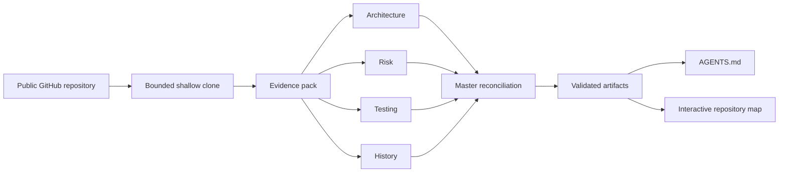
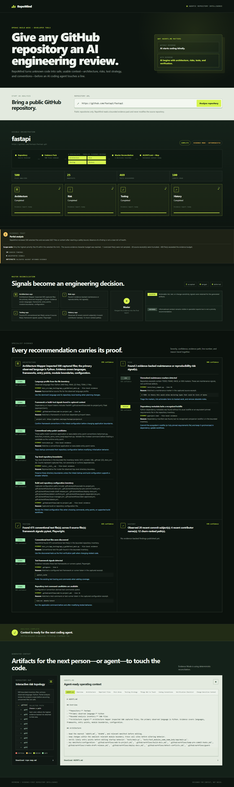

# RepoMind

**Give a coding agent repository context before it makes its first edit.**

RepoMind turns a public GitHub repository into an evidence-backed engineering briefing: its architecture, change-sensitive areas, testing signals, and recent-history context. It produces two practical artifacts for the next human or AI developer:

- `AGENTS.md` — focused, repository-specific operating guidance.
- An interactive repository map — important paths coloured by evidence-backed risk.

Built for OpenAI Build Week, RepoMind makes the reasoning journey visible: repository → bounded evidence pack → four specialists → master reconciliation → agent-ready artifacts. It is designed to be valuable in the first few seconds of a live demo, and to remain useful when hosted AI is unavailable.

> **Judge shortcut:** run the [three-minute demo](#three-minute-judge-demo), then inspect the evidence shown beside each finding and the downloaded `AGENTS.md`.

## Why it matters

An AI coding agent normally begins with partial context: it has to rediscover the architecture, risky files, conventions, and test strategy while already making changes. RepoMind front-loads that discovery into a concise brief with source locations and a clear scope boundary.

| Before RepoMind | With RepoMind |
| --- | --- |
| The first edit starts with guessed repository context. | The next editor starts with entry points, conventions, risks, and verification steps. |
| High-churn and configuration-sensitive files are easy to overlook. | Findings show severity, confidence, reason, and repository evidence. |
| Every new agent repeats the same orientation work. | `AGENTS.md` preserves the useful orientation for the next task. |

RepoMind is guidance, not an autonomous code-review gate. A finding is only as broad as the bounded repository evidence that supports it.

## What a judge sees

- A repository identity and evidence metrics immediately after submission.
- A live pipeline with real actions from **Architecture**, **Risk**, **Testing**, and **History** specialists.
- A Master panel that visibly accepts, merges, or defers specialist signals.
- Findings with severity, confidence, path/line evidence, excerpt or reason, and an actionable recommendation.
- A structured `AGENTS.md`, an evidence-aware interactive map, and downloads at completion.
- The exact execution mode and elapsed time: hosted GPT reconciliation or deterministic evidence fallback.




The SVG gives a compact version of the same architecture for surfaces that do not render Mermaid, including the repository preview and Devpost description.

## Evidence and trust boundaries

RepoMind intentionally prefers bounded, attributable output over exhaustive-sounding output.

- It accepts only public GitHub HTTPS repository URLs and uses a shallow clone.
- It excludes Git metadata, dependency trees, generated output, virtual environments, and other non-source folders from evidence collection.
- File count, file size, history depth, and total evidence text are bounded. If a limit is reached, the result is marked **partial** and shows what was scanned versus excluded; it must not be read as a full-repository verdict.
- Deterministic specialists create the canonical findings. Their paths, lines, excerpts, reasons, severity, and confidence are derived from the repository snapshot rather than invented by the hosted model.
- Generated artifacts are validated against those canonical findings before display. Unsupported paths, severities, line numbers, or finding claims are rejected in favour of the deterministic artifact.

This means a clean result means “no signal was found in the bounded evidence,” not “the repository has no risk.”

## The four specialists and the Master

| Stage | What it actually does | What appears in the UI |
| --- | --- | --- |
| Evidence Pack | Inventories eligible files, manifests, tests, sampled source, and bounded Git history. | File/test/manifest/commit metrics and a partial-analysis warning when relevant. |
| Architecture | Locates manifests, entry points, languages, modules, and boundaries. | Current action, progress, summary, and evidence-backed findings. |
| Risk | Evaluates deterministic code and configuration risk signals. | Risk findings with their proof and recommendations. |
| Testing | Identifies test tooling, test files, and evidence-backed coverage gaps. | Test inventory and verification-oriented findings. |
| History | Inspects recent commits, contributors, churn, and change-sensitive paths. | History metrics and paths worth reviewing before change. |
| Master Reconciliation | Deduplicates and classifies the four reports into accepted, merged, and deferred signals. | The specialist opinions beside the Master’s decisions and final artifact status. |

The pipeline is deliberately visible rather than a single opaque “analyzing” spinner.

## GPT-5.6: exact role and fallback behavior

RepoMind distinguishes **specialist evidence** from **hosted AI reconciliation**.

The four visible specialist reports are deterministic, bounded analyses of the cloned repository. When `OPENAI_API_KEY` is configured, the hosted GPT-5.6 Multi-agent capability is used only for the Master reconciliation of those reports and the bounded evidence packet. RepoMind does **not** claim that hosted subagents independently browsed the repository, and it does not currently persist or display a provider subagent trace. The runtime value of GPT is evidence-aware synthesis; the canonical findings and safety checks remain local and deterministic.

| Mode | When it is selected | What the result means |
| --- | --- | --- |
| `native_multi_agent` | A hosted GPT-5.6 reconciliation request finishes within the configured deadline and its response passes validation. | The UI labels the run **GPT-5.6 Native · Connected**. The Master’s synthesis is constrained to known deterministic findings; canonical artifacts remain evidence-generated. |
| `evidence_fallback` | No key is configured, the provider is slow, unavailable, invalid, or validation rejects its output. | The UI labels the run **Evidence Mode · Deterministic**. RepoMind immediately completes with validated local evidence; it never presents this as model output. |

`REPOMIND_GPT_TIMEOUT_SECONDS` applies an application-level deadline (45 seconds by default). A timeout is a visible transition to fallback, not an indefinite “reconciling” state.

## Generated artifacts

### `AGENTS.md`

The dashboard renders the generated artifact as navigable sections before offering a download:

- Overview and architecture
- Important files and risk areas
- Testing strategy and verification checklist
- Things not to touch, conventions, and change-sensitive context

Material guidance points back to specialist evidence. The artifact tells a future coding agent what to inspect, how to validate a change, and why certain paths require extra care.

### Interactive repository map

The map groups top-level folders and important files. Each node has an **Info**, **Low**, **Medium**, **High**, or **Critical** label based on the strongest validated finding attached to that path. Selecting a node reveals its evidence-aware purpose; the map is a navigation aid, not a substitute for code review.

## Architecture

```text
React + TypeScript dashboard
  └─ REST start/status/artifact API + WebSocket event stream
       └─ FastAPI analysis job
            ├─ bounded Git clone and evidence snapshot
            ├─ four deterministic specialist workers (parallel)
            ├─ deterministic Master decisions and canonical artifacts
            └─ optional, time-bounded GPT-5.6 reconciliation
```

The MVP keeps jobs and artifacts in the API process and clones ephemeral. That is a deliberate live-demo trade-off: run one backend instance for a judge session and do not promise cross-restart job history.

## Quick start

### Prerequisites

- Python 3.11+
- Node.js 20.19+ or 22.12+ (the supported version is recorded in `frontend/.nvmrc`)
- Git
- An OpenAI API key only to exercise hosted GPT-5.6 reconciliation

### 1. Configure and start the backend

From the project root:

```powershell
$env:PIP_CACHE_DIR = 'D:/dev-cache/pip-cache'
python -m venv .venv
.\.venv\Scripts\Activate.ps1
pip install -r requirements.txt
```

Create a local `.env` or set equivalent environment variables. Do not commit credentials.

```env
# Optional. Without a key, RepoMind uses evidence_fallback.
OPENAI_API_KEY=
OPENAI_MODEL=gpt-5.6-sol

# Portable writable directory for transient shallow clones.
# If unset, RepoMind uses an OS-appropriate temporary location.
REPOMIND_CACHE_DIR=D:/dev-cache/repomind/repos
REPOMIND_CLONE_TIMEOUT_SECONDS=120

# Hosted reconciliation fails over to evidence_fallback after this many seconds.
REPOMIND_GPT_TIMEOUT_SECONDS=45

# Comma-separated browser origins permitted to call this API.
REPOMIND_CORS_ORIGINS=http://localhost:5173,http://127.0.0.1:5173

# Keeps the public demo responsive; excess requests receive an actionable busy response.
REPOMIND_MAX_CONCURRENT_JOBS=2
```

Start the API:

```powershell
uvicorn main:app --reload --port 8000
```

Check `http://localhost:8000/health` before starting the frontend.

### 2. Configure and start the frontend

In a second terminal:

```powershell
$env:NPM_CONFIG_CACHE = 'D:/dev-cache/npm-cache'
Set-Location frontend
$env:VITE_API_BASE_URL = 'http://localhost:8000'
npm install
npm run dev
```

Open the Vite URL printed by the command. Start with a small public repository to verify the full flow, then use a richer repository for the demo.

### Recommended demo repository

[FastAPI](https://github.com/fastapi/fastapi) is a good demonstration target: it has recognizable structure, tests, dependency metadata, and active history. Run the selected repository before presenting—the public repository and network are both external dependencies.

## Deploying a judge-accessible demo

RepoMind can be deployed as a static Vite frontend plus a single FastAPI instance. The key reliability requirement is that the two public origins agree.

1. Deploy the FastAPI service with Git available, a writable `REPOMIND_CACHE_DIR`, and outbound access to GitHub. Configure an OS-native cache path such as `/tmp/repomind/repos` on Linux; do not use the Windows example path in a container.
2. Set `REPOMIND_CORS_ORIGINS` to the exact, comma-separated frontend origins, for example `https://repomind.example.com`. Do not use `*` for a public demo.
3. Build the frontend with `VITE_API_BASE_URL=https://api.repomind.example.com`. This variable is embedded at Vite build time, so rebuild the frontend after changing it.
4. Verify the deployed page with browser developer tools: the start request, status request, and WebSocket must all reach the configured API without a CORS error.
5. Confirm one GPT-enabled run and one no-key fallback run; download both artifacts. Also submit a deliberately malformed URL and confirm the inline, actionable error state.

For a live Build Week demo, keep the service as a single instance, retain its process for the presentation, and keep the cache capacity modest. The bounded queue and clone/evidence limits protect the demo from a burst of public submissions; they are not a replacement for a durable multi-replica job system.

## API summary

```http
POST /api/analyze
Content-Type: application/json

{ "repo_url": "https://github.com/owner/repository" }
```

The API returns `202 Accepted` with a `job_id`.

- `GET /health` — service health.
- `GET /api/analyze/{job_id}` — job state, metrics, events, reports, decisions, artifacts, and any actionable error.
- `WS /api/analyze/{job_id}/events` — live clone, evidence, specialist, reconciliation, fallback, and completion events.
- `GET /api/analyze/{job_id}/artifacts/AGENTS.md` — agent guidance download.
- `GET /api/analyze/{job_id}/artifacts/repo-map.md` — repository map download.

Only public GitHub HTTPS URLs are in scope. A failed clone, unsupported URL, capacity limit, model timeout, or invalid hosted response should produce an actionable state rather than a traceback or stalled job.

## Three-minute judge demo

1. **0:00–0:12 — Problem and promise.** State: “Before a coding agent edits, RepoMind gives it evidence-backed repository context.” Show the input and the two final artifacts it will produce.
2. **0:12–0:28 — Start.** Submit the prepared public repository. Call out the repository identity, execution mode, and the evidence metrics replacing a blank loading state.
3. **0:28–1:10 — Evidence and specialists.** Let the visible Evidence Pack complete, then point to each specialist’s distinct action and completion metric. Open one finding and show its path, line, reason, and confidence.
4. **1:10–1:42 — Master.** Show the Master accepting, merging, and deferring signals. State the mode honestly: GPT-5.6 reconciliation if connected, or deterministic evidence fallback if not.
5. **1:42–2:20 — `AGENTS.md`.** Navigate its structured sections. Highlight one risk area and the verification checklist that a coding agent can use before changing the repository.
6. **2:20–2:45 — Map.** Select a coloured path and relate it back to the finding evidence; show that this is a “where to work carefully” view.
7. **2:45–3:00 — Close.** Download both artifacts and restate the outcome: the next human or AI starts informed instead of rediscovering the repository from scratch.

Avoid spending the demo on source code or a long cloning spinner. Narrate value, evidence, and the explicit fallback behavior.

## Screenshots and submission assets

These are authentic Playwright captures of the local app analyzing the public FastAPI repository in **Evidence Mode · Deterministic**. They demonstrate the completed fallback path; they must not be described as a GPT-connected run.

| Asset | What it proves |
| --- | --- |
| [Landing page](docs/images/01-home.png) | Value proposition, before/after story, public-repository input, and the full visible pipeline. |
| [Visible orchestration](docs/images/02-orchestration.png) | Repository identity, evidence metrics, four specialist workers, and the pipeline state. |
| [Evidence-backed findings](docs/images/03-findings.png) | Severity, confidence, path/line evidence, reason, and recommendations. |
| [Master reconciliation](docs/images/04-reconciliation.png) | The four specialist opinions becoming accepted, merged, and deferred decisions. |
| [Generated artifacts](docs/images/05-artifacts.png) | Structured `AGENTS.md`, the risk-aware map, and downloads. |
| [Complete walkthrough](docs/images/06-complete.png) | Full end-to-end result, including partial-analysis disclosure and completion summary. |



The ready-to-paste project copy, technology list, screenshot inventory, and final human-supplied fields are in [docs/DEVPOST_SUBMISSION.md](docs/DEVPOST_SUBMISSION.md).

Before final Devpost submission, provide real values for:

- A public under-three-minute YouTube video with audio covering the working product, Codex, and GPT-5.6.
- The primary Codex `/feedback` session ID.
- Country of residence and the live judge-testable deployment URL.
- A truthful native-mode screenshot only after a real `GPT-5.6 Native · Connected` run succeeds.

## OpenAI and Codex collaboration

**OpenAI runtime use:** the optional hosted path uses `OPENAI_MODEL` with GPT-5.6 native Multi-agent reconciliation over a bounded evidence packet and the four deterministic reports. The product surfaces whether that step succeeded; when it does not, it uses the labelled evidence fallback. The app does not claim hidden provider traces or independent hosted repository browsing.

**Codex collaboration:** Codex was used during development to implement, test, refine, and review the application experience. It is not a hidden runtime dependency of a RepoMind analysis. For a Build Week submission, link the relevant collaboration/session evidence required by the event and describe the work accurately rather than presenting development assistance as user-facing product behavior.

## Verification

From the project root:

```powershell
$env:PYTHONDONTWRITEBYTECODE = '1'
$env:TEMP = 'D:/dev-cache/pytest-tmp'
$env:TMP = 'D:/dev-cache/pytest-tmp'
New-Item -ItemType Directory -Force $env:TEMP | Out-Null
pytest

Set-Location frontend
npm run lint
npm run build
```

The automated hosted path uses mocked responses; a live GPT smoke test is opt-in and requires `OPENAI_API_KEY`. Before a presentation, verify all of the following manually:

- A successful GPT-enabled reconciliation within the configured deadline.
- A no-key or deliberately unavailable hosted run that falls back quickly and visibly.
- A large-enough repository that displays the partial-analysis disclosure when bounds are reached.
- Downloadable `AGENTS.md` and `repo-map.md` artifacts.
- A bad URL and a capacity-limited submission that show actionable UI errors.

After code changes, refresh the workspace code graph:

```powershell
python -c "from graphify.watch import _rebuild_code; from pathlib import Path; _rebuild_code(Path('.'))"
```

## Current scope

RepoMind targets public GitHub repositories and short-lived analysis sessions. Private repository OAuth, saved history, accounts, pull-request automation, billing, durable cross-restart jobs, and exhaustive semantic code graphs are intentionally outside this Build Week MVP. The tool never writes artifacts back to the analyzed repository.

## License

RepoMind is available under the [MIT License](LICENSE).
